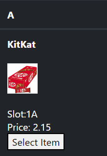

# Vending Machine
## Installation
1. With PHP and composer installed run the following command
`composer install --ignore-platform-reqs`.
1. Then use Laravel's sail to set up the developement environment `./vendor/bin/sail up`
1. Add sail as an alias `alias sail='[ -f sail ] && bash sail || bash vendor/bin/sail'`
1. Setup the database  `sail artisan migrate`
1. Finally set up the admin credentials `sail artisan orchid:admin admin admin@admin.com password`
## What was used?
- [Laravel\PHP](https://laravel.com/)
- [Orchid](https://orchid.software/)
- [Docker Compose](https://docs.docker.com/compose/)

## Who is this for?
1. ### Maintenance 
Url: http://localhost/admin
- 

- Use the credentions email:admin.com password:password. As set up above

- As Maintenance make sure you've configured your machine structure by navigating to Manage Machine Space > Create new 

- Then add some items to a slot. Do this by navigating to Manage Items> Create New

- As you can see I have two items already in my stock 

2. ### Customer
URL: http://localhost
- Only items with a stock greater that zero will appear. 
- Select an item to using the select item button
- You will notice the item name on the upper left of the page, next to the Purchase button[selected-item](guide/images/selected-item.PNG)
- Use the list of currencies below to insert cash collected. You'll notice the amount goes up by the denomination entered[insert-cash](guide/images/insert-cash.PNG)

Depending on whether the amount was enough or not, the status should reflect one of the following messages
1. #itemName purchased
2. #itemName is out of stock
3. Please enter enought cash to purchase #itemName

